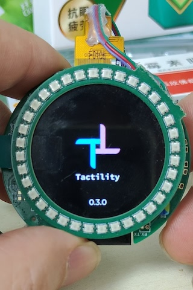
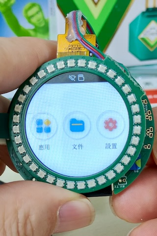
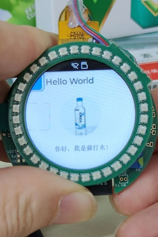

Tactility-Halo
================

Frok of Tactility OS. It's only used for my round screen project. If you also want to experience it on your custom motherboard, you can refer to mine.

中文教程：[Tactility OS尝鲜教程](https://www.xiaohongshu.com/user/profile/6451d3230000000010029646?xsec_token=YBbzXLaJizJ7IQlxx2l6cSEkW-5a3dmE03cyhCsVFcoOo%3D&xsec_source=app_share&xhsshare=CopyLink&appuid=6451d3230000000010029646&apptime=1748497153&share_id=db714a412bc74abbb3800400884cca67&share_channel=copy_link)（XHS）

&nbsp;&nbsp;&nbsp;&nbsp;

## Overview

Tactility is an operating system that focuses on the ESP32 microcontroller family.

See [https://tactility.one](https://tactility.one) for more information.

&nbsp;&nbsp;

You can run built-in apps or start them from an SD card:

&nbsp;&nbsp;

It's easy to manage system settings:

&nbsp;&nbsp;

## License

[GNU General Public License Version 3](LICENSE.md)
